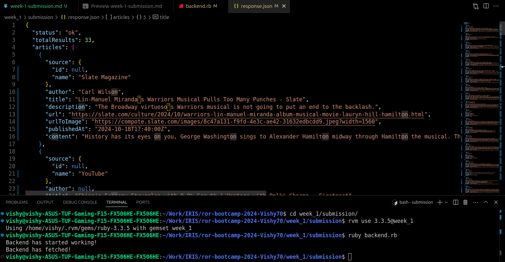

# WEEK 1 - Mimick Full Stack (Vishal Kamath)

This week's assignment was all about applying what I've learnt about Ruby for creating a simple, decoupled front-end back-end news article website.

## Backend - Ruby

The simple [ruby backend](./backend.rb) uses the [Faraday http client](https://lostisland.github.io/faraday/#/) to fetch the news articles, with an optional query parameter for a keyword search. The json body is then saved to the ['database'](./response.json).

- To test this, ensure you open a terminal in the `week_1/submission` directory.
- Ensure to use a setup option [specified here](../../setup/README.md)
- Setup a gemset 'week_1' and run `rvm use 3.3.5@week_1`
- Run `gem install faraday json`
- Finally, run `ruby backend.rb`
- Check the results in [response.json](./response.json)

Potential Improvements:
- Better handling of bad requests (currently: none...)

## Frontend - HTML, CSS, JS

The website is just a simple demo to revise HTML & CSS, and display the articles in a simple manner. Nothing fancy :)

The javascript has a few functions:

### fetchFromDB

Mimicks fetching from a [database](./response.json). This is asynchronous, hence loads a spinner and calls [articlesToDOM](#articlestodom)to handle changes to the DOM for the newly obtained articles. Has support for a query, passed in from [search_query.txt](./search_query.txt)

### fetchFromJS

Fetches directly from the client browser. This is asynchronous, hence loads a spinner and calls [articlesToDOM](#articlestodom)to handle changes to the DOM for the newly obtained articles. Takes a single parameter: **query**

### articlesToDOM

Parses the json given and transforms it into a list of _article components_. Finally, renders all inside the `container` div. Expects articles to contain a **title**, **author**, **source**, **image**, **descritption**, and a **link** to the article.

### spinner

Simple spinner in javascript

### handleSearch

Event handler for search from the client. Handles the query, to be passed to [fetchFromJS](#fetchfromjs).

### keyToSearch

Event handler for _Enter_ key, to enable a search.

## Screenies

### Landing Page

### Using Search

### Spinner in Action

### Backend in Action

